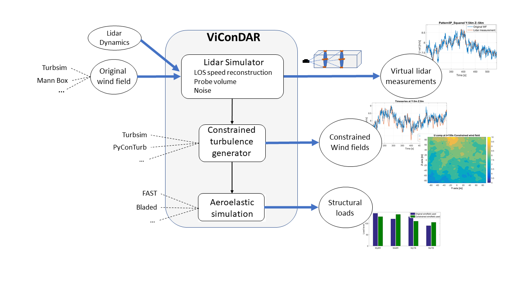

# Virtual Constrained turbulence and liDAR measurements (ViConDAR)

## Introduction

Modular framework allowing to scan a numerical wind field with a virtual lidar and create constrained turbulent wind fields for wind turbine simulations. 

The aim of the framework is to provide an open source base for such tests but also to be used as a platform where other modules (e.g. different velocity vector reconstruction methods) can be easily added and tested. More information on motivation and possible applications can be found in [1].

## Code and folder structure

The framework is based around a wrapper script calling the different modules. The input/output definition is done through a function that gathers all the necessary parameters called `InputParameters.m`. In principal, this should be the only interaction with the user. The different functionalities (e.g. performing virtual lidar measurements or constraining the windfields) are activated by using the relevant flags defined in the inputs.  

### Main folder

#### InputParameters.m
The main IO interface of ViConDAR. Here you can switch on/off flags, define parameters and request plots. Exact definitions of flags and variables can be found in the code commnets. Any new modules should havew all relevant flags and parameters defined here. 

#### ViConDAR.m
Main wrapper script to be executed. This part should be modified only to call a new module if one is added.

### Functions folder
All functions required for VIConDAR are gathered here. Any new modules should be added here.

### HelpfulStandAlone folder
This folder contains scripts used for batch processing and other small useful tools. These run as stand alone and do not interface directly with ViConDAR.

### Other directories
The other directories are defined in the *InputParameters.m* and are created while the code is running. These directories include folders for lidar outputs, inputs to constrained turbulence generators as well as outputs

## Run Test Case

In order to check everything works and see the format of the files a test file is provided. Please read the readme file in the folder for instructions on how to run the test cases.
 
## Adding user modules

In order to maintain modularity, any new addition should respect the structure of ViConDAR. The data format should be kept the same and all the rest of the functionalities should remain functional. The best practice would be to create a function with your new addition that will be added on top of the existing functions. Moreover, relevant flags and parameter definitions should be added in the `InputParameter.m` file. Once you have tested your implementation in your personal fork please create a pull request to the master stating your exact modifications as well as an example test case. After reviewing it we will add it to the master aknowledging the contribution. 

## Issues / requests

In order to report a bug or a feature request as well as any other comment please use the issues functionality of github. We have created templates for bugs and feature requests, please use these. In case of other comments please use the empty issue form. 

## Dependencies - Requirements
- The input windfields files can be created with any kind of turbulence generator as long as they are convereted to the global Vicondar format. An example of the structure of such a file is included in the test files folder (TEST_Sh25_SD01_V15_TI05.mat). Currently Turbsim by NREL (https://github.com/OpenFAST/openfast/tree/master/modules/turbsim) and Mann turbulence generator by DTU (https://github.com/OpenFAST/openfast/tree/master/modules/turbsim) are directly supported with relevant functions in the functions and HelpfulStandAlone folders of this repository. The python script for converting the Mann format to the Vicondar format is written by Davide Conti from DTU Wind Energy.
- Currently the constrained turbulence generators connected to ViConDAR are Turbsim V2.00 Alpha from NREL (https://github.com/OpenFAST/openfast/tree/master/modules/turbsim), PyConTurb from DTU (https://gitlab.windenergy.dtu.dk/pyconturb/pyconturb) and Nikolay Dimitrov's method from DTU. The turbsim executable is included in the present repository compiled by SWE (Matthias Kretschmer) including some relevant bug fixes from NREL as well as some additional input options. A version of PyConTurb is also included although the user is encouraged to update to the latest version from the repository. Dimitrov's method is implemented in python by Davide Conti from DTU who developed the scripts included here.
- Some functions regarding reading and writing .wnd files are created and distributed as open source by NREL. We have slightly modified some of them for our purposes and added them in this repository. Exact details can be found in the headers of the source code. 
- Python(>=v3.5) has to be installed in the system. The path to the correct python.exe corresponding to the python environment including PyConTurb and its dependencies has to be explicitly stated in the InputParameters file.  
- The framework is developed and tested with Matlab 2015b 64bit. We have done some tests with Matlab 2018b 64bit but not all functionalities are guaranteed to work properly.

## Resources
1. Pettas V., Costa García F., Kretschmer M., Rinker J.M., Clifton A., Cheng P.W., “A numerical framework for constraining synthetic wind fields with lidar measurements for improved load simulations”. In: AIAA Scitech 2020 Forum. American Institute of Aeronautics and Astronautics; 2020:1-6. doi:10.2514/6.2020-0993
2. Rinker, J. M., “PyConTurb: an open-source constrained turbulence generator”, Journal of Physics: Conference Series, Vol.
1037, 2018, p. 062032. URL http://stacks.iop.org/1742-6596/1037/i=6/a=062032?key=crossref.e906e6eebbe4b3f8b1b8ad8e740718b1.
3. NWTC Information Portal (Alpha Versions).  https://nwtc.nrel.gov/Alphas. Last modified 14-June-2016 ;
4. Dimitrov N., Natarajan A., “Application of simulated lidar scanning patterns to constrained Gaussian turbulence fields for load validation”, 2017, Wind Energ., 20: 79– 95. https://doi.org/10.1002/we.1992 .

## Citing
If you use ViConDAR for a publication, use the following citation:

Pettas V, Costa García F, Kretschmer M, Rinker JM, Clifton A, Cheng PW. A numerical framework for constraining synthetic wind fields with lidar measurements for improved load simulations. In: AIAA Scitech 2020 Forum. American Institute of Aeronautics and Astronautics; 2020:1-6. https://doi.org/10.2514/6.2020-0993

or in .bib format: 

@inproceedings{Pettas2020,
address = {Reston, Virginia},
author = {Pettas, Vasilis and {Costa Garc{\'{i}}a}, Francisco and Kretschmer, Matthias and Rinker, Jennifer M. and Clifton, Andrew and Cheng, Po Wen},
booktitle = {AIAA Scitech 2020 Forum},
doi = {10.2514/6.2020-0993},
isbn = {978-1-62410-595-1},
month = {jan},
number = {January},
pages = {1--6},
publisher = {American Institute of Aeronautics and Astronautics},
title = {{A numerical framework for constraining synthetic wind fields with lidar measurements for improved load simulations}},
url = {https://doi.org/10.2514/6.2020-0993 },
year = {2020}
}
